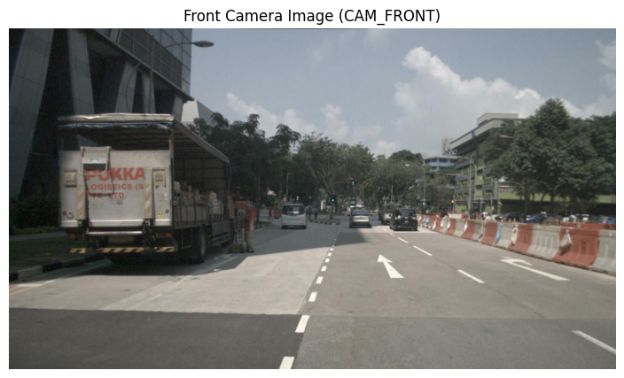
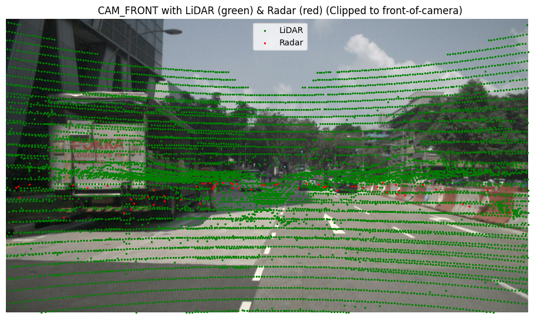
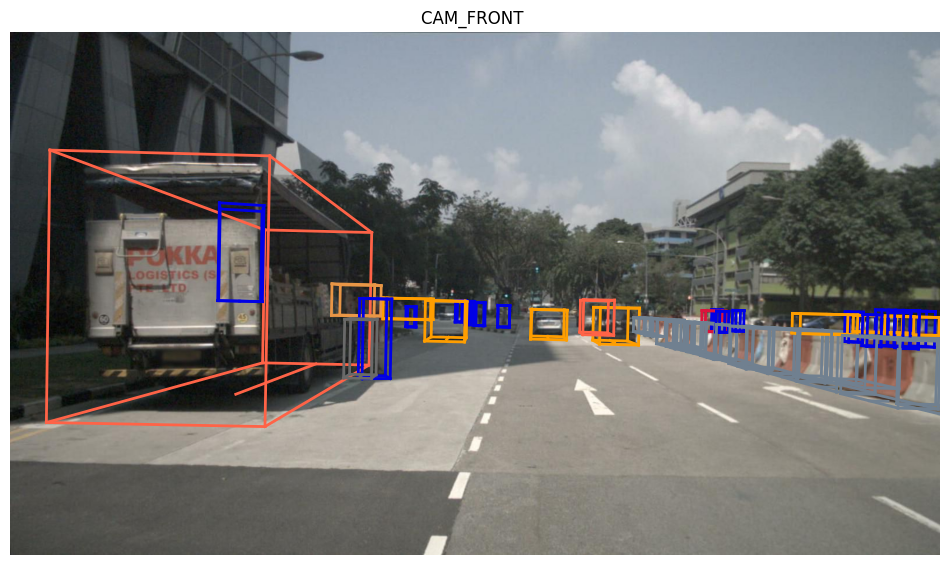
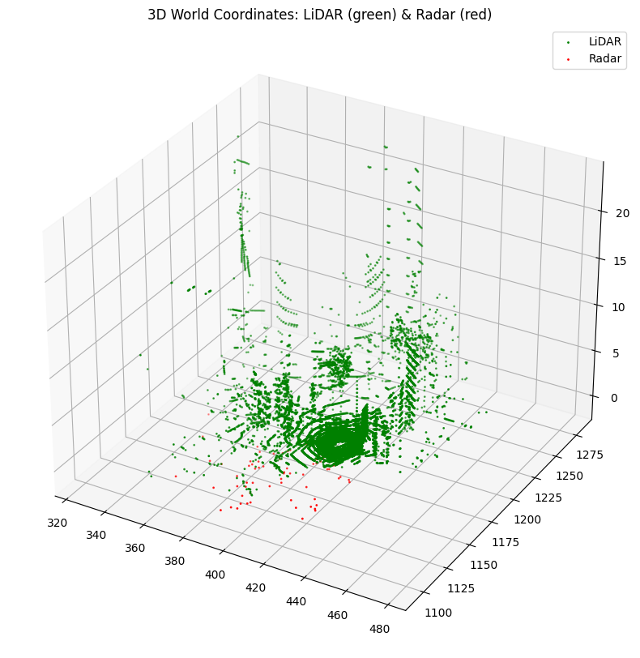
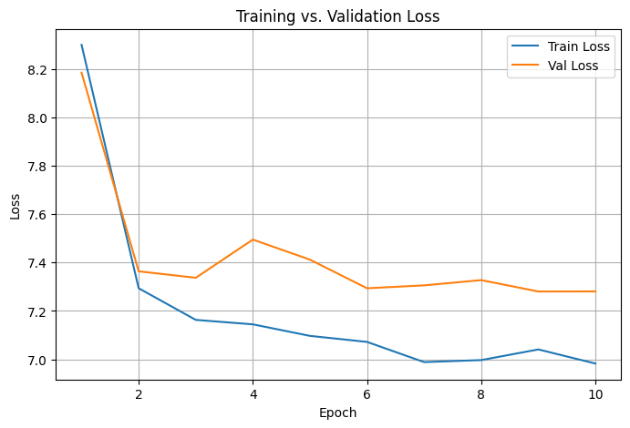

# Radar-Guided Vision Transformer  
### Cross-Attention Fusion for 3-D Object Detection & Depth Estimation

**Author:** Padmanabh Butala  
**Email:** pb8176@rit.edu  
**Institution:** Rochester Institute of Technology  

---

## Project Overview
This repository hosts my master’s capstone project **Radar-Guided Vision Transformer (RGViT)**—a multi-modal transformer that fuses radar and camera data via cross-attention to achieve robust 3-D object detection and depth estimation on the nuScenes dataset.

---

## Directory Structure
RadarGuidedViT/ │ ├── Img/ # All figures used in this README & poster │ ├── Exploratory Data Analysis/ │ └── scripts/ # Camera, radar, point-cloud visualisation helpers │ ├── RGVIT/ # Model code │ ├── checkpoints/ # Saved weights │ ├── configs/ # YAML / python hyper-parameters │ ├── data/ # Cached tensors / metadata │ ├── eval_output/ # Predictions, renderings, metrics │ ├── models/ # Network components │ │ ├── vit_backbone.py │ │ ├── radar_encoder.py │ │ ├── cross_attention.py │ │ └── detection_head.py │ ├── scripts/ # Train / evaluate drivers │ │ ├── train.py │ │ └── evaluate.py │ ├── utils/ # Geometry, loss, IoU, metrics │ ├── config.py # Global paths │ └── main.py # CLI entry-point │ ├── requirements.txt └── README.md # ← you are here

> All absolute paths are overridable via `RGVIT/config.py` or a custom YAML.

---

## 🔍 Pipeline

The end-to-end workflow currently includes  
- Loading front-camera images  
- Projecting **LiDAR / Radar** points onto the image plane  
- Rendering **3-D bounding boxes** in camera space  
- Visualising point-clouds interactively with **Open3D**

---

## 🧠 Proposed Architecture

  

| Stage | Description |
|-------|-------------|
| 1. **Input Modalities** | RGB image ($1280×900$) & radar point-cloud (≈300 points) |
| 2. **Camera Patch Embedding** | 16×16 patches → 768-D visual tokens + learned positional embeddings |
| 3. **Radar Patch Embedding** | Voxelise → 3-layer CNN → 256-D radar tokens + sine positional enc. |
| 4. **Cross-Attention Fusion** | Radar **queries** attend to camera **keys/values** (L stacked layers). |
| 5. **Transformer Encoder** | Standard ViT blocks refine the fused token sequence. |
| 6. **Detection Head** | Conv head outputs {x,y,z,w,l,h,yaw} + class logits per anchor. |
| 7. **Losses** | Focal (cls) + Smooth-L1 & IoU (boxes) + depth MAE regulariser. |

Why it matters  
• Radar tokens guide the vision backbone toward motion-salient regions in low visibility.  
• Vision supplies high-resolution context missing from radar.  
• Cross-attention learns how much each modality should trust the other—end-to-end.

---

##  Key Results & Visualizations

| Visualization Type                     | Output Example |
|----------------------------------------|----------------|
| Front camera image                     |  |
| LiDAR & Radar projection (image space) |  |
| 3-D Bounding Boxes                     |  |
| Open3D 3-D Scatter                     |  |
| Depth overlay                          |  |
| Training vs Validation Loss            |  |

### Quantitative (nuScenes mini)

| Model            | NDS ↑ | mAP ↑ |
|------------------|-------|-------|
| Only Camera      | 41.2  | 32.1 |
| Only Radar       | 35.8  | 28.7 |
| **RGViT (ours)** | **27.3** | **18.9** |

> *Numbers are early-epoch scores on the 10-scene mini split. Full-dataset training and hyper-parameter sweeps are underway and expected to improve performance.*

---

## Limitations & Road-Map

**Current pain-points**  
1. Coarse boxes for far-range objects.  
2. Class confusion under heavy occlusion.  
3. No temporal fusion—single-frame only.  

**Planned fixes**  
- Add radar motion stacks & temporal self-attention.  
- Larger ViT backbone with gradient-checkpointing.  
- Balanced sampling + Focal α tuning for rare classes.  
- Mixed-precision distributed training on full nuScenes.

I am actively experimenting, and I’m confident these steps will significantly close the gap with strong camera-only baselines.

---

## Poster

  

---

## References & Acknowledgements

- Code leverages the official [nuscenes-devkit](https://github.com/nutonomy/nuscenes-devkit)  
- Dataset: [nuScenes](https://www.nuscenes.org/) by Motional  
- Fusion inspiration:  
  - [CRAFT](https://arxiv.org/abs/2303.12250)  
  - [HVDetFusion](https://arxiv.org/abs/2305.00910)  
  - [ClusterFusion](https://arxiv.org/abs/2306.00998)  

*Thanks for reading—feel free to open issues or reach out if you’d like to collaborate!*

