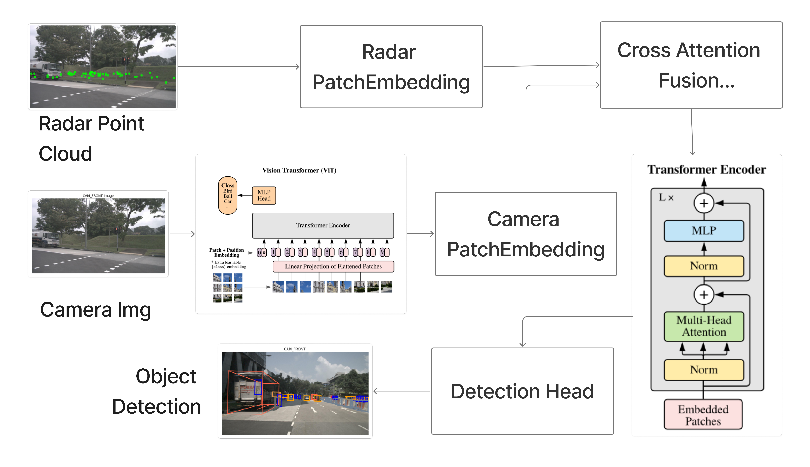
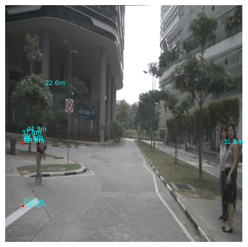
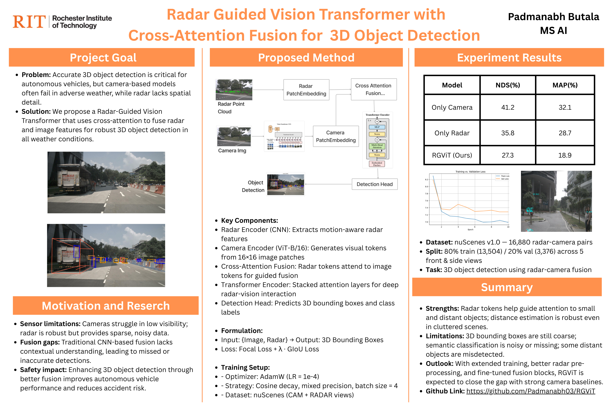

# Radar-Guided Vision Transformer  
### Cross-Attention Fusion for 3-D Object Detection & Depth Estimation

**Author :** Padmanabh Butala  
**Email :** pb8176@rit.edu  
**Institution :** Rochester Institute of Technology  

---

## 📌 Project Overview

This repository contains my master’s capstone project **Radar-Guided Vision Transformer (RGViT)** — a multi-modal transformer that fuses camera and radar data using cross-attention for 3D object detection on the nuScenes dataset. In real-world driving, cameras struggle in low-visibility conditions (e.g., fog, rain, night), while radar remains robust but lacks spatial and semantic resolution. Most existing fusion techniques simply concatenate features or fuse them late in the pipeline without learning modality importance. RGViT addresses this by letting radar features guide the vision transformer — focusing attention on motion-salient regions — while vision supplies rich context. The cross-attention mechanism learns to weigh and combine both modalities adaptively, enabling robust perception even under adverse conditions.

---

## Directory Structure  

```text
RadarGuidedViT/                ─── Project root
│
├── Img/                       ── Figures used in README & poster
│
├── Exploratory Data Analysis/ ── Quick-look notebooks & sensor-vis helpers
│   └── scripts/               ───  camera, radar, point-cloud visualisation
│
├── RGVIT/                     ─── Source code of the model
│   ├── checkpoints/           ─── Pre-trained & intermediate weights
│   ├── configs/               ─── YAML / python hyper-parameter files
│   ├── data/                  ─── Cached nuScenes tensors & meta
│   ├── eval_output/           ─── Predictions, renderings, evaluation JSON
│   ├── models/                ─── Network blocks
│   │   ├── vit_backbone.py
│   │   ├── radar_encoder.py
│   │   ├── cross_attention.py
│   │   └── detection_head.py
│   ├── scripts/               ─── Training & inference drivers
│   │   ├── train.py
│   │   └── evaluate.py
│   ├── utils/                 ─── Geometry, IoU, loss, metrics
│   ├── config.py              ─── Global path overrides
│   └── main.py                ─── One-line CLI entry-point
│
├── requirements.txt
└── README.md                  ─── ← you are here
```


> All absolute paths are overridable via `RGVIT/config.py` or a custom YAML.

---

## 🔍 Pipeline

The end-to-end workflow currently includes  
- Loading front-camera images  
- Projecting **LiDAR / Radar** points onto the image plane  
- Rendering **3-D bounding boxes** in camera space  
- Visualising point-clouds interactively with **Open3D**

---

## 🧠 Proposed Architecture

<p align="center">
  
</p>

| Stage | Description |
|-------|-------------|
| 1. **Input Modalities** | RGB image ($1280×900$) & radar point-cloud (≈300 points) |
| 2. **Camera Patch Embedding** | 16×16 patches → 768-D visual tokens + learned positional embeddings |
| 3. **Radar Patch Embedding** | Voxelise → 3-layer CNN → 256-D radar tokens + sine positional enc. |
| 4. **Cross-Attention Fusion** | Radar **queries** attend to camera **keys/values** (L stacked layers). |
| 5. **Transformer Encoder** | Standard ViT blocks refine the fused token sequence. |
| 6. **Detection Head** | Conv head outputs {x,y,z,w,l,h,yaw} + class logits per anchor. |
| 7. **Losses** | Focal (cls) + Smooth-L1 & IoU (boxes) + depth MAE regulariser. |

Why it matters  
• Radar tokens guide the vision backbone toward motion-salient regions in low visibility.  
• Vision supplies high-resolution context missing from radar.  
• Cross-attention learns how much each modality should trust the other—end-to-end.

---

##  Key Results & Visualizations

| Visualization Type                     | Output Example |
|----------------------------------------|----------------|
| Front camera image                     |  |
| LiDAR & Radar projection (image space) |  |
| 3-D Bounding Boxes                     |  |
| Open3D 3-D Scatter                     |  |
| Depth overlay                          |  |
| Training vs Validation Loss            |  |

### Quantitative (nuScenes mini)

| Model            | NDS ↑ | mAP ↑ |
|------------------|-------|-------|
| Only Camera      | 41.2  | 32.1 |
| Only Radar       | 35.8  | 28.7 |
| **RGViT (ours)** | **27.3** | **18.9** |

> *Numbers shown are from early-epoch evaluations on the full nuScenes v1.0 dataset. Full training runs and hyper-parameter tuning are in progress and expected to improve final performance.*

---

## Limitations & Road-Map

**Current pain-points**  
1. Coarse boxes for far-range objects.  
2. Class confusion under heavy occlusion.  
3. No temporal fusion—single-frame only.  

**Planned fixes**  
- Add radar motion stacks & temporal self-attention.  
- Larger ViT backbone with gradient-checkpointing.  
- Balanced sampling + Focal α tuning for rare classes.  
- Mixed-precision distributed training on full nuScenes.

I am actively experimenting, and I’m confident these steps will significantly close the gap with strong camera-only baselines.

---

## Poster

<p align="center">
  
</p>

---

## References & Acknowledgements

- Code leverages the official [nuscenes-devkit](https://github.com/nutonomy/nuscenes-devkit)  
- Dataset: [nuScenes](https://www.nuscenes.org/) by Motional  
- Fusion inspiration:  
  - [CRAFT](https://arxiv.org/abs/2303.12250)  
  - [HVDetFusion](https://arxiv.org/abs/2305.00910)  
  - [ClusterFusion](https://arxiv.org/abs/2306.00998)  

*Thanks for reading—feel free to open issues or reach out if you’d like to collaborate!*


